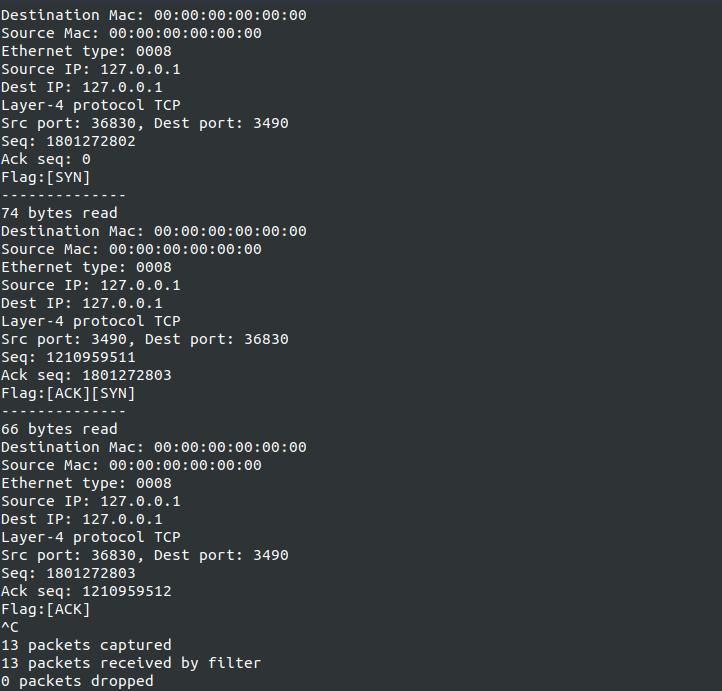

# Netwink



## 使用

```shell
netwink [-f] [interface name] //指定网卡名
        [-p] [port]//指定端口
        [-i] [IP]//指定 IP
        [-t] [protocol]//指定协议 TCP/UDP/ICMP

        [-n] ////以主机名方式输出主机 IP
        [-l] //显示 localhost 的包
        [-s] [out.txt] //保存到文件
        [-v] //查看版本
        [-?] //help
```